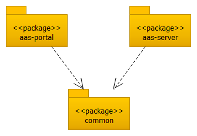
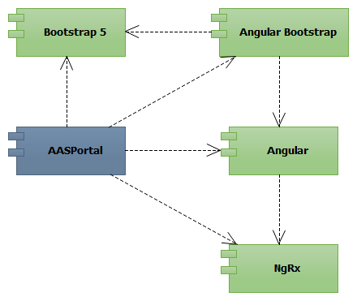

Architecture and Design
=======================
*AASPortal* is an Angular based application. The UI is implemented with the Bootstrap 5 frontend toolkit in conjunction with Bootstrap widgets (ng-bootstrap). For managing the global and local state of the *AASPortal* application the NgRx framework is used.

.. image:: aas-portal-project.png

