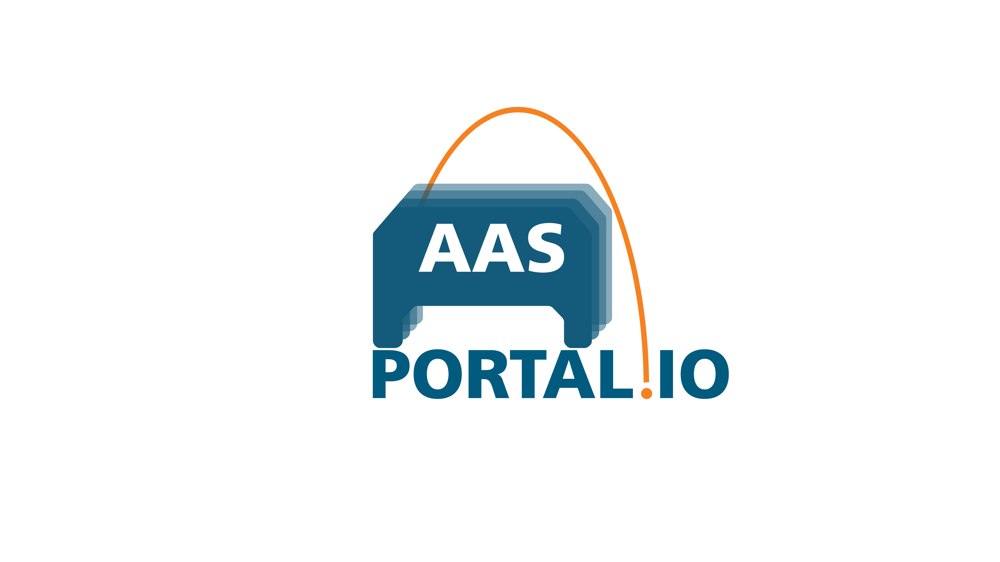

# AASPortal


**AASPortal** is a Node.js based web portal for the visualization and management of Asset Administration Shells (AAS). The implementation uses the concepts of the document "Details of the Asset Administration Shell" published on https://www.plattform-i40.de which is licensed under Creative Commons CC BY 4.0. 

Check out the :doc:`gettingstarted` section to learn how to setup Visual Studio Code and start using and developing the *AASPortal*. Learn more about the :doc:`architecture` of *AASPortal*, and check out the :doc:`usage` section to learn about available search filters for AAS and which Endpoints can be connected to the *AASPortal*.

This project is under active development.

```{toctree} 
:hidden:
:caption: Getting Started
:maxdepth: 3
gettingstarted.md
```

```{toctree} 
:hidden:
:caption: Architecture
:maxdepth: 3
Architecture <architecture.md>
```

```{toctree} 
:hidden:
:caption: Getting Started
:maxdepth: 3
usage.md
```

.. image:: https://readthedocs.org/projects/fpethig-rtd-tutorial/badge/?version=latest
    :target: https://fpethig-rtd-tutorial.readthedocs.io/en/latest/?badge=latest
    :alt: Documentation Status
